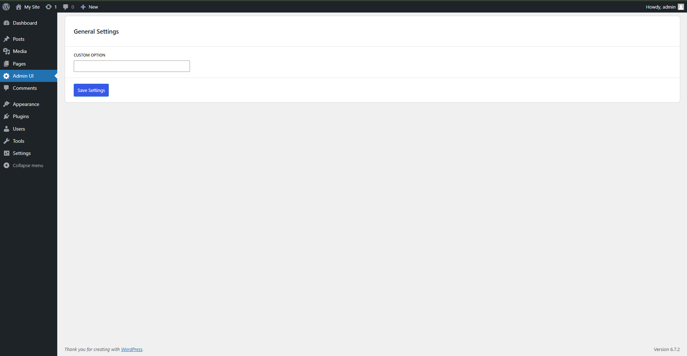

# WP React Admin Panel

A custom WordPress admin plugin built with React and WordPress data store API. This plugin provides an intuitive settings interface for managing custom options within the WordPress admin panel.


## Features

- Built with React and @wordpress/data API.
- Uses Redux-style state management.
- Provides an intuitive UI using @wordpress/components.
- Asynchronous API fetching and saving of settings.
- Fully compatible with WordPress Gutenberg-based admin UI.

## Installation

### 1. Upload the Plugin
Manually upload the plugin folder to your `/wp-content/plugins/` directory or install it via the WordPress admin.

### 2. Install Dependencies
Run the following command in the project root to install required dependencies:

```sh
npm install
```

### 3. Build the Plugin
Compile and bundle the plugin scripts using:

```sh
npm run build
```

Alternatively, during development, use:

```sh
npm run start
```

### 4. Activate the Plugin
Go to the WordPress admin panel and activate "WP React Admin Panel" from the Plugins menu.

## Usage

After activation, navigate to **Admin UI** in the WordPress admin dashboard. Here, you can modify and save custom options.

